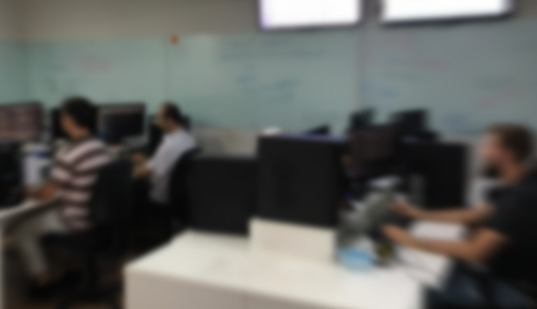

Title: About
Date: 2016-11-07 10:00
status: hidden

Founded and located in [Florianópolis, Santa Catarina](https://www.google.com.br/maps/place/CELTEC%2FAUTOCARGO/@-27.592772,-48.5950586,17z/data=!3m1!4b1!4m5!3m4!1s0x952737d16a4cd911:0x7ff4d0db88c550e!8m2!3d-27.592772!4d-48.5928699), at 1990, Celtec specialized in development of equipments for special vehicles (such as motorhome, ambulances, boats, common use utilities, etc) acquiring know-how in embedded eletronics, vehicular installations and technical assistance in field.

### Autocargo

Our main product [Autocargo](https://www2.autocargo.com.br) started as a desktop application and evolved to a web app some years ago.

Autocargo is a platform to track vehicles using GPS, our app is able from displaying positions of vehicles in a map to more complex features such as monitoring trips and managing deliveries.

#### Next steps

We work a lot with geospatial data and currently we're working in new product focused in logistic which is in under beta, validating with some clients.

Also we started playing with some Data Science hoping to apply some intelligence specific for each client, generating a kind-of Dashboard for our clients being able making decisions fastly.

---

#### Ownership

Your opinion and suggestion are always considered. For these reasons, team members are self-managed having autonomy in decision-making.

## Interested?

Check our [Open positions](|category|open-positions) page.
